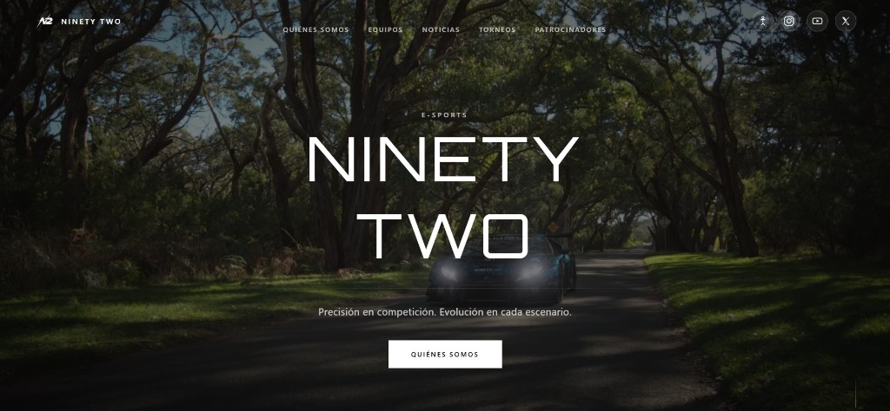

# Ninety Two E-Sports

Sitio web de la organización: landing con pantalla de carga, equipos, noticias, torneos y patrocinadores.

## Vista previa

**Pantalla de carga**


**Página principal**



Sitio en producción: [ninety-two-e-sports.vercel.app](https://ninety-two-e-sports.vercel.app)

## Requisitos

- [Node.js](https://nodejs.org/) 20 o superior
- npm (incluido con Node)

## Inicio rápido

```bash
npm install
npm run dev
```

Abre [http://localhost:5173](http://localhost:5173).

## Scripts disponibles

| Comando                           | Descripción                                                     |
| --------------------------------- | --------------------------------------------------------------- |
| `npm run dev`                     | Servidor de desarrollo con recarga en caliente                  |
| `npm run dev:clean`               | Igual que `dev`, pero limpia la caché de Vite antes de arrancar |
| `npm run build`                   | Compila TypeScript y genera la versión de producción en `dist/` |
| `npm run build:clean`             | Build de producción forzando reoptimización de dependencias     |
| `npm run preview`                 | Sirve localmente el contenido de `dist/` (probar el build)      |
| `npm run lint`                    | Revisa el código con ESLint                                     |
| `npm run format`                  | Formatea el código con Prettier                                 |
| `npm run format:check`            | Comprueba el formato sin modificar archivos                     |
| `npm run test`                    | Ejecuta los tests con Vitest                                    |
| `npm run typecheck`               | Comprueba tipos sin generar archivos                            |
| `npm run tournaments:sync-titles` | Sincroniza títulos de videos de torneos desde YouTube           |

## Estructura del proyecto

```
├── assets/          # Imágenes, videos y marca (importados en el código con @assets)
├── public/          # Favicon y archivos con URL fija (/favicon.png)
├── src/
│   ├── app/         # Componente raíz de la aplicación
│   ├── features/    # Módulos por pantalla (landing, loading-screen, accessibility)
│   ├── shared/      # Hooks y utilidades reutilizables
│   └── styles/      # Estilos globales
├── docs/            # Guías para desarrolladores (convenciones, capturas)
├── index.html       # Punto de entrada HTML
└── dist/            # Salida de `npm run build` (no editar; se regenera)
```

### Dónde poner archivos nuevos

- **Fotos, logos de sponsors, videos** → carpeta `assets/` e importar en TypeScript:

  ```ts
  import foto from "@assets/integrantes/americanos/nombre.jpg";
  ```

- **Favicon u otros estáticos con URL fija** → carpeta `public/` (por ejemplo `public/favicon.png`).

No uses una segunda carpeta `assets` dentro de `src/`: todo el material visual vive en `assets/` en la raíz del proyecto.

### Código fuente (`src/`)

El código sigue una organización por **features**:

- `features/landing-page/` — página principal y secciones
- `features/loading-screen/` — animación de carga inicial (canvas)
- `features/accessibility/` — panel de accesibilidad y preferencias del usuario
- `shared/` — lógica compartida (hooks, animaciones, utilidades)

Cada feature puede tener sus propias subcarpetas `components/`, `hooks/`, `data/`, etc. Eso es intencional, no son duplicados.

Convenciones detalladas (imports, nombres ES/EN, animaciones reveal, assets): ver [`docs/CONVENTIONS.md`](docs/CONVENTIONS.md).

## Alias de importación

| Alias     | Carpeta   |
| --------- | --------- |
| `@/`      | `src/`    |
| `@assets` | `assets/` |

## Tecnologías
- Cursor AI
- React 18 + TypeScript
- Vite 6
- Tailwind CSS 4
- Vitest + ESLint + Prettier

## Despliegue

### Vercel (recomendado)

1. Importa el repositorio en [Vercel](https://vercel.com).
2. Framework: **Vite** (detección automática).
3. Build command: `npm run build`
4. Output directory: `dist`
5. Install command: `npm install`

El archivo `vercel.json` incluye rewrites para SPA (rutas client-side).

### GitHub

1. No incluyas `node_modules/`, `dist/` ni `.env` (ya están en `.gitignore`).
2. El workflow `.github/workflows/ci.yml` ejecuta formato, lint, typecheck, tests y build en cada push/PR.
3. Quien clone el repo debe ejecutar `npm install` y luego `npm run dev`.

## No veo los cambios al recargar

Este proyecto es **React + Vite**. No uses **Live Server** ni abras `index.html` directamente en el navegador.

1. En la terminal del proyecto: `npm run dev`
2. Abre solo **http://localhost:5173** (no el puerto 5500 ni archivos de `dist/`)
3. Si sigue igual: para el servidor (Ctrl+C), ejecuta `npm run dev:clean` y recarga con **Ctrl+Shift+R** (recarga forzada sin caché)
4. `dist/` es la build de producción: solo se actualiza con `npm run build`. Editar ahí no sirve para desarrollo.

En VS Code/Cursor: **Terminal → Run Task → dev: Vite (ver cambios en vivo)**.
