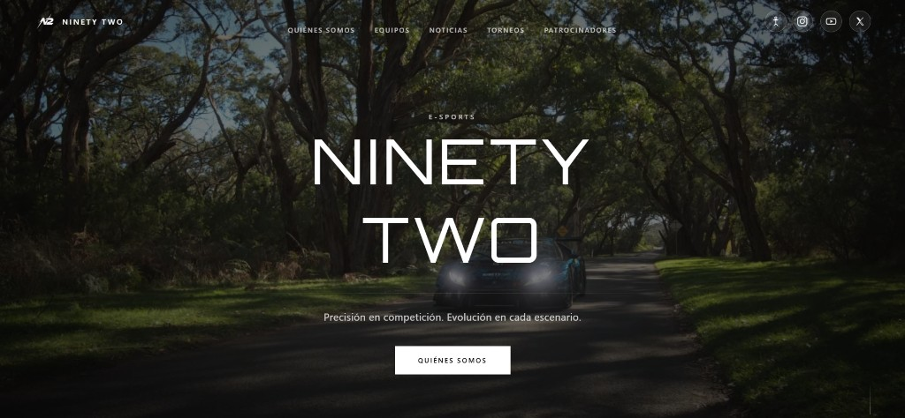

# Ninety Two E-Sports

Web del equipo. En producción: [ninetytwoesports.com](https://www.ninetytwoesports.com)

Inicio (quiénes somos, diseños, patrocinadores) y páginas propias: equipos, fotos, noticias y torneos. No hay backend: es un sitio estático.

**Pantalla de carga**


**Página principal**



## Arrancar en local

Hace falta [Node.js 20](https://nodejs.org/) o más (npm viene con Node).

```bash
npm install
npm run dev
```

Abre [http://localhost:5173](http://localhost:5173). Es Vite: no uses Live Server ni abras `index.html` a mano.

Si no ves el cambio: para el servidor (`Ctrl+C`), `npm run dev:clean` y recarga forzada (`Ctrl+Shift+R`). `dist/` solo se genera con `npm run build`; no edites ahí.

## Dónde va cada cosa

| Qué | Dónde |
| --- | --- |
| Fotos de pilotos, noticias, sponsors | `assets/…` y un `import` en el TypeScript que las usa |
| Diseños / liveries | `assets/Designs/` + una entrada en `TEAM_DESIGNS` (`src/features/landing-page/data/designs.ts`) |
| Favicon u URL fija | `public/` |

Nombres en minúsculas con guiones (`bmw-frontal.jpeg`). El original de Gran Turismo 7 va a 3840×2160; lo que se pega en el chat baja a 1024 y no vale para publicar.

El código está por pantallas en `src/features/`. `/fotos` no está en el menú: se abre desde Diseños.

- Cómo se escribe el código: [`docs/CONVENTIONS.md`](docs/CONVENTIONS.md)
- Por qué se eligió algo: [`docs/DECISIONS.md`](docs/DECISIONS.md)

Quien mantiene el sitio está aprendiendo el flujo a mano. El agente explica y deja al menos un cambio de cada lote para hacerlo uno mismo.

## Subir un cambio

```bash
git status
git add assets/Designs/ src/features/landing-page/data/designs.ts
git commit -m "Se agregan nuevos diseños"
git push
```

Ajusta las rutas al archivo que hayas tocado. No subas `node_modules/`, `dist/` ni `.env`. En cada push, GitHub Actions corre formato, lint, tipos, tests y build. Vercel publica desde `main`.

## Otros comandos

`npm run build` deja la web lista en `dist/`. `npm run preview` la sirve para probar esa build. `npm run lint`, `format` y `test` son lo que usa el CI. Los títulos de YouTube de torneos se actualizan con `npm run tournaments:sync-titles`.
